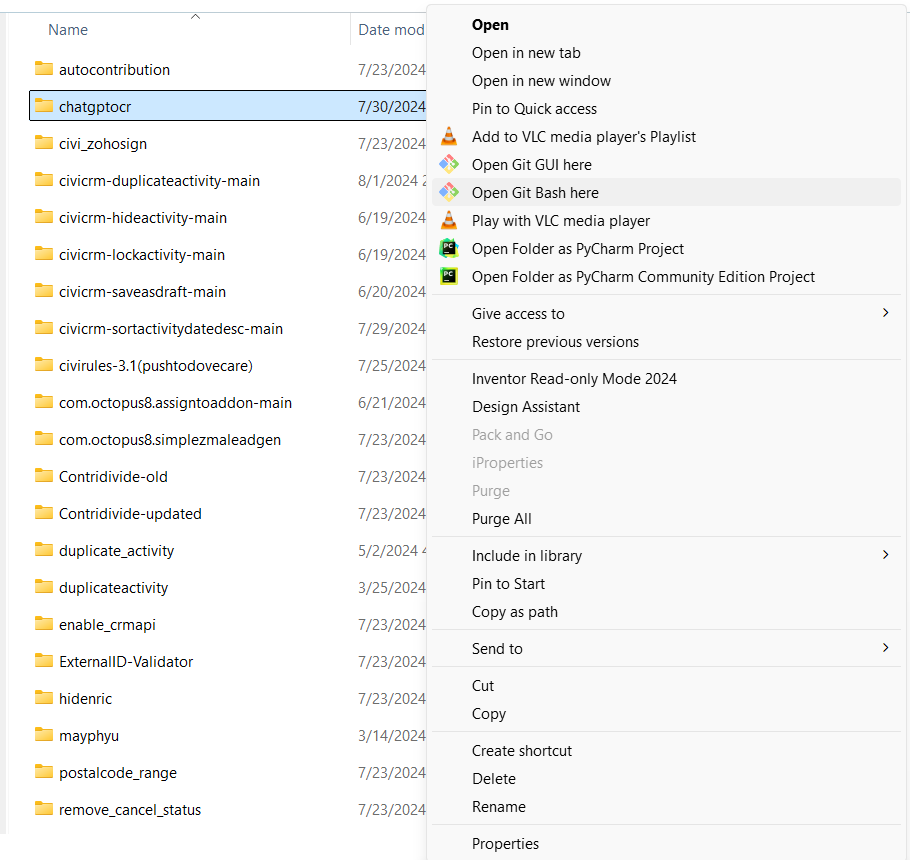
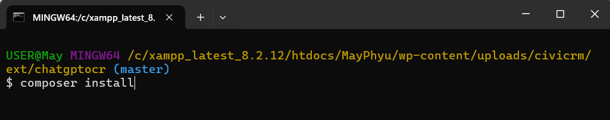
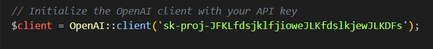
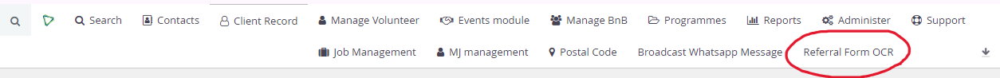
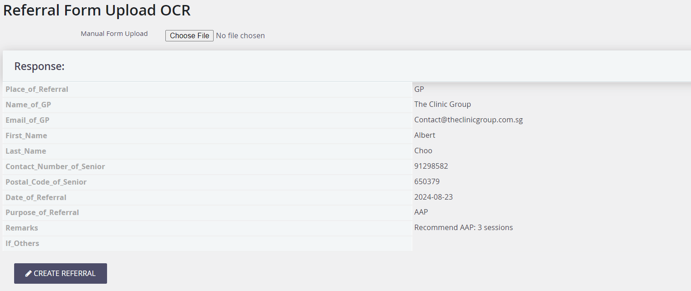
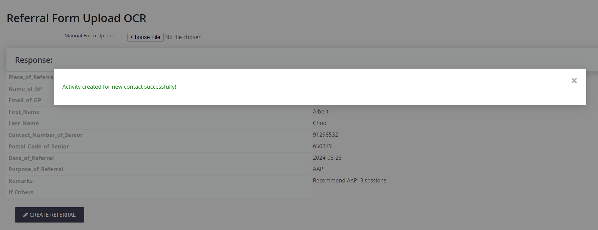

# com.octopus8.chatgptocr

# Best way to download
If you do not want to make any changes mentioned above, go to https://dev.aacsconnect.com/wp-admin/admin.php?page=CiviCRM and download the “chatgptocr” extension.

# Objective
To allow the use of OpenAI's OCR to create activities by uploadiing pictures of physical forms.

# Overview

- The OpenAI OCR Extension is developed to read information from files to be used and processed by our CiviCRM System; it allows the creation of Contacts, Activities.

- Users are able to edit the fields/information that is returned from OpenAI OCR’s if there are any discrepancies due to factors such as handwriting and image quality. 

- This helps streamline the conversion of information on a physical document into our system.

# Installation
- Download the extension and extract the file 
- Right click the extracted file and click “Show more options”.
Then, click “Open Git Bash here”.

- Then, run ‘“composer install’’’ to download the dependencies

- Populate your OpenAI Secreat Key in the php files in “CRM/Chatgptocr/Form” as shown below.

- Upload the files into your extension folder and install the extension.

# How to use
After installing and enabling the extension,
1. Go to “CiviCRM Menu Bar >> Referral Form OCR” 

2. Upload an image file that you want to create the activity and press ‘Submit’.

3. Users are able to edit the fields returned by OpenAI if there are any discrepancies.

4. Click ‘Create Referral’ and a new Referral activity will be created.
 

The extension is licensed under [AGPL-3.0](LICENSE.txt).